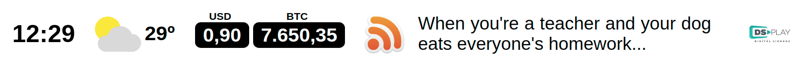

# DSPLAY - Horizontal Information Bar

A [React](https://reactjs.org/) [HTML-based template](https://developers.dsplay.tv/docs/html-templates) for the [DSPLAY - Digital Signage](https://dsplay.tv/) platform — a horizontal bar with up to five independent, optional widgets: clock, weather, currency quotes, RSS news, and a sponsor logo.

> Built with [Vite](https://vitejs.dev/), requires Node.js 22.22.2+, 24.15.0+, or 26+ (see `.nvmrc`).

## Features

- **Clock** — local time, formatted for the configured locale.
- **Weather** — current temperature and condition icon for a given latitude/longitude.
- **Currency quotes** — converts two source currencies into a target currency.
- **News** — one random headline from an RSS feed, refreshed periodically.
- **Sponsor** — a single logo image.

Every widget is independently optional — it only renders once its required variable(s) are set. `widgets_sequence_query` controls which widgets appear and in what order.



## Template variables

| Key                     | Type    | Description                                                                                     |
|--------------------------|---------|---------------------------------------------------------------------------------------------------|
| `clock`                 | boolean | Enables/disables the Clock widget. Defaults to `true`.                                          |
| `latitude`              | string  | Latitude of the place to get weather for, e.g. `41.1621376`. Weather widget is hidden if unset.  |
| `longitude`             | string  | Longitude of the place to get weather for, e.g. `-8.656973`. Weather widget is hidden if unset.  |
| `source_currency_1`     | string  | First source currency to convert, e.g. `BRL`, `USD`, `EUR`.                                     |
| `source_currency_2`     | string  | Second source currency to convert.                                                               |
| `target_currency`       | string  | Target currency both source currencies are converted to.                                        |
| `rss_url`               | string  | RSS feed URL. Leave empty to hide the News widget.                                               |
| `rss_logo_box_color`    | color   | Background color behind the feed's channel image.                                               |
| `sponsor_logo`          | image   | Logo shown in the Sponsor widget. Leave empty to hide it.                                        |
| `sponsor_logo_box_color`| color   | Background color behind the sponsor logo.                                                        |
| `widgets_sequence_query`| string  | Order and selection of widgets — see [Widget sequence syntax](#widget-sequence-syntax) below.    |
| `bg_color`              | color   | Background color of the whole bar. Defaults to `white`.                                         |
| `bg_image`              | image   | Background image of the whole bar.                                                              |
| `text_color`            | color   | Text color of the whole bar. Defaults to `black`.                                               |
| `currency_box_color`    | color   | Background color behind each currency value.                                                    |
| `currency_text_color`   | color   | Text color of each currency value.                                                               |

> Remember to also register these as Template Vars (same name and type) when configuring this template in the DSPLAY CMS.

### Widget sequence syntax

`widgets_sequence_query` is a comma-separated list of single-character widget codes, controlling both which widgets show and their order:

| Character | Widget          |
|-----------|-----------------|
| `c`       | Clock           |
| `w`       | Weather         |
| `q`       | Currency quotes |
| `n`       | News            |
| `s`       | Sponsor         |

E.g. `"s,c,w,n,q"`. Defaults to `"s,w,q,n,c"`. Unknown characters are ignored; any widget code left out still appears, appended after the ones you listed.

## Local development

```sh
npm install
npm start
```

`public/dsplay-data.js` defines `dsplay_config`/`dsplay_media`/`dsplay_template` mock globals used only when the template isn't running inside the actual DSPLAY app. Edit it to try out different values — the DSPLAY Player App replaces it with real content at runtime.

## Packing (release build)

```sh
npm run zip
```

This builds the template with Vite, which also generates `template-variables.json` + `template-example-data.json` (via [@dsplay/template-manifest](https://www.npmjs.com/package/@dsplay/template-manifest)'s Vite plugin) — the DSPLAY CMS reads these two files to auto-detect this template's variables and seed default preview values. It then generates `template.zip`, ready to be deployed to the [DSPLAY Web Manager](https://manager.dsplay.tv/template/create).

## Maintaining dependencies

Regular npm dependencies, not vendored files:

```sh
npm outdated
npm update
```

For a version outside the declared range (typically a major bump), apply it deliberately and verify `npm start`, `npm run build`, and `npm test` still work before committing.

### Commit conventions

See [AGENTS.md](AGENTS.md).

## More

To see more about DSPLAY HTML Templates, visit: https://developers.dsplay.tv/docs/html-templates
